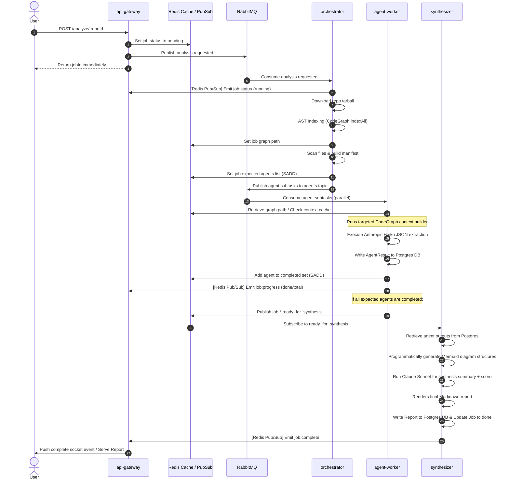
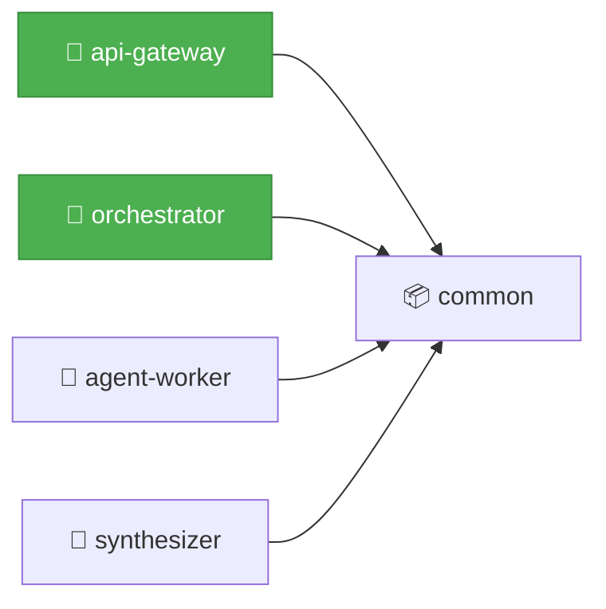
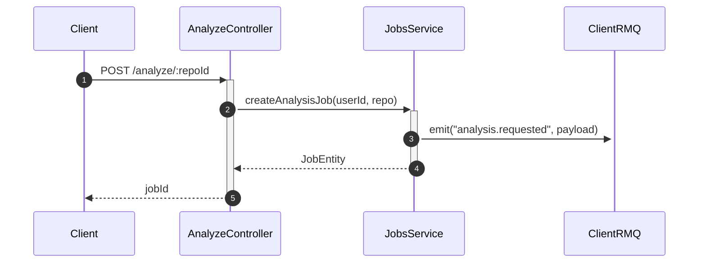
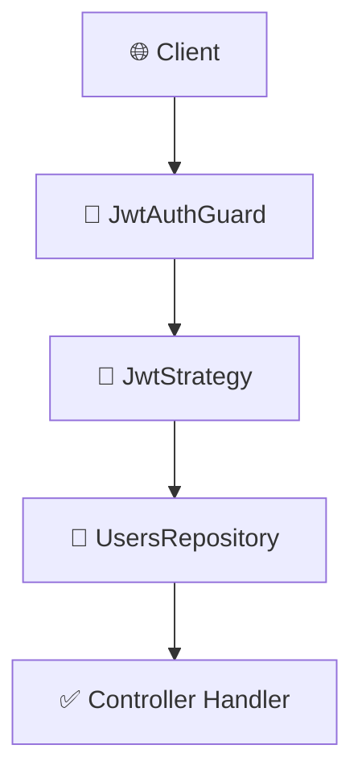
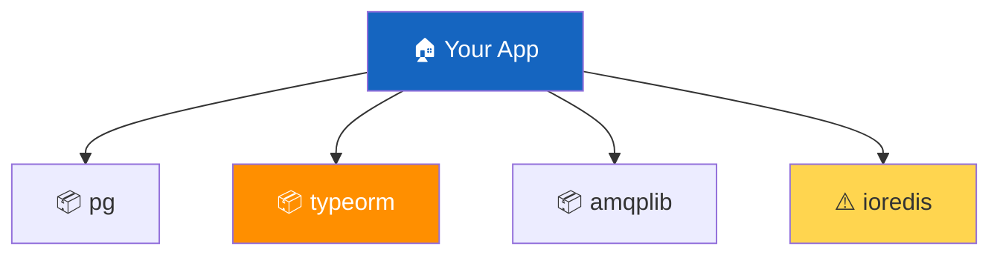
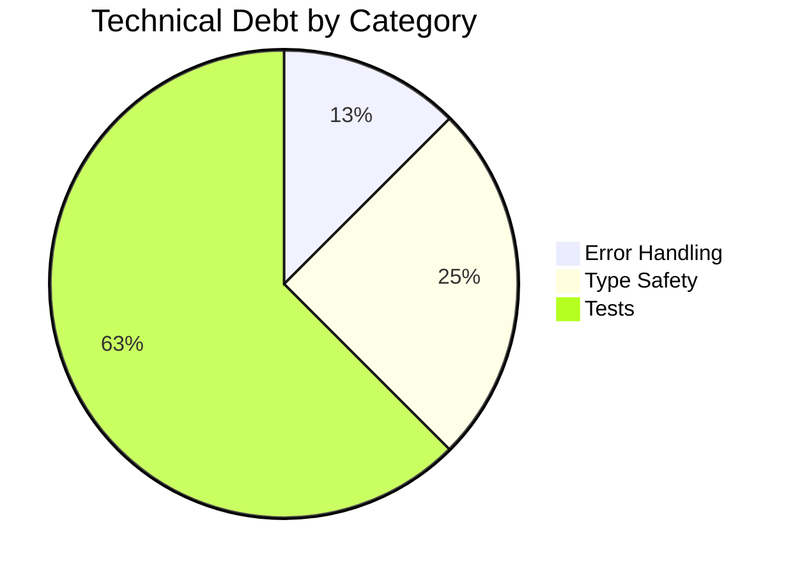

# CodeMind Project Audit & Feature List

This document provides a comprehensive, line-by-line architectural analysis of the **CodeMind** (AI Repo Analyzer) codebase, a detailed log of local Git modifications, a complete list of features implemented, and a **User Usability Overview with concrete API and Socket.io examples**.

---

## 1. Project Overview & Data Flow

CodeMind is designed as a NestJS monorepo microservice architecture that analyzes a codebase and generates a multi-dimensional intelligence report.

The end-to-end data flow is illustrated below:



---

## 2. Line-by-Line Code Audit & Component Breakdown

### 2.1 Shared Library (`libs/common/`)

The common library provides code, database definitions, and RabbitMQ/Redis connection specifications shared across all four applications.

*   [libs/common/src/entities/user.entity.ts](file:///Users/user/Desktop/Node%20Js%20Projects/CodeMind/libs/common/src/entities/user.entity.ts)
    *   **UserEntity**: Captures authenticated user details. Stores `githubId` (as bigint to prevent integer overflows), `githubUsername`, `avatarUrl`, and `githubAccessTokenEncrypted`.
    *   **Security Design**: Explicitly stores the GitHub access token encrypted using AES-256-GCM to ensure token security at rest.
*   [libs/common/src/entities/job.entity.ts](file:///Users/user/Desktop/Node%20Js%20Projects/CodeMind/libs/common/src/entities/job.entity.ts)
    *   **JobEntity**: Represents a repo analysis execution. Tracks `userId`, `repoFullName` (e.g. `owner/repo`), and `status` (`pending`, `running`, `done`, `failed`), along with `createdAt` and `completedAt` timestamps.
*   [libs/common/src/entities/agent-result.entity.ts](file:///Users/user/Desktop/Node%20Js%20Projects/CodeMind/libs/common/src/entities/agent-result.entity.ts)
    *   **AgentResultEntity**: Stores results of individual agent executions. Keeps a reference to `jobId`, the `agentType` (`architecture`, `security`, `dependency`, `quality`, or `docs`), a `rawOutput` JSONB field (populated by the agent), a `tokensUsed` tracking object (`{ input: number, output: number }`), execution `status` (`success` or `failed`), `durationMs`, and any optional `error` text.
*   [libs/common/src/entities/report.entity.ts](file:///Users/user/Desktop/Node%20Js%20Projects/CodeMind/libs/common/src/entities/report.entity.ts)
    *   **ReportEntity**: Houses the final synthesized report. Maps a unique `jobId` to a `markdownContent` text block.
*   [libs/common/src/crypto/token-encryption.service.ts](file:///Users/user/Desktop/Node%20Js%20Projects/CodeMind/libs/common/src/crypto/token-encryption.service.ts)
    *   **TokenEncryptionService**: Uses standard Node `crypto` to encrypt/decrypt strings.
    *   **Methodology**: AES-256-GCM. Generates a random 12-byte initialization vector (`iv`), encrypts the plaintext, retrieves the 16-byte authentication tag, and formats the database payload as `iv:authTag:ciphertext` in Base64 encoding. Decryption reads this layout and validates the tag.
*   [libs/common/src/constants/redis.constants.ts](file:///Users/user/Desktop/Node%20Js%20Projects/CodeMind/libs/common/src/constants/redis.constants.ts)
    *   Centralizes Redis key schemas to prevent hand-written string errors:
        *   `jobStatusKey(jobId)`: `job:{id}:status`
        *   `jobGraphPathKey(jobId)`: `job:{id}:graph_path`
        *   `jobAgentsDoneKey(jobId)`: `job:{id}:agents_done` (Redis Set of completed agents)
        *   `jobAgentsExpectedKey(jobId)`: `job:{id}:agents_expected` (Redis Set of expected agents)
        *   `agentContextKey(jobId, agentType, queryHash)`: `agent_context:{jobId}:{agentType}:{queryHash}` (cached CodeGraph context builds)
        *   `jobSubmitRateLimitKey(userId)`: `ratelimit:job_submit:${userId}`
        *   `jobReadyForSynthesisChannel(jobId)`: `job:{jobId}:ready_for_synthesis` (Redis pub/sub channel for orchestration)
        *   `jobEventsChannel(jobId)`: `job:{jobId}:events` (Real-time progress notification channel)
*   [libs/common/src/constants/rabbitmq.constants.ts](file:///Users/user/Desktop/Node%20Js%20Projects/CodeMind/libs/common/src/constants/rabbitmq.constants.ts)
    *   Defines RabbitMQ queues, exchanges, and routing keys:
        *   `ANALYSIS_REQUESTED_QUEUE`: `analysis.requested` (direct queue)
        *   `AGENTS_TOPIC_EXCHANGE`: `agents.topic` (topic exchange)
        *   `AGENT_ROUTING_KEYS`: maps each agent type to routing keys (`agent.architecture`, `agent.security`, etc.)
        *   `AGENT_QUEUES`: maps each agent type to unique consumer queues (`agent.architecture.queue`, `agent.security.queue`, etc.)
*   [libs/common/src/codegraph/codegraph.service.ts](file:///Users/user/Desktop/Node%20Js%20Projects/CodeMind/libs/common/src/codegraph/codegraph.service.ts)
    *   **CodeGraphService**: Wraps programmatic `@colbymchenry/codegraph` package interactions.
    *   `initAndIndex(repoPath, jobId)`: Initializes the database index for the target repo path.
    *   `openReadOnly(repoPath, jobId)`: Re-opens the indexed sqlite DB in concurrent-safe WAL read-only mode so multiple agent runners can query it concurrently.
    *   `buildContext(cg, query, jobId, agentType, maxNodes)`: Triggers `cg.buildContext` with a hard limit of `maxNodes` nodes. Transparently handles caching the generated context inside Redis (`agent_context:...`) with a 24-hour TTL, saving substantial computing overhead.
*   [libs/common/src/rabbitmq/rabbitmq-options.factory.ts](file:///Users/user/Desktop/Node%20Js%20Projects/CodeMind/libs/common/src/rabbitmq/rabbitmq-options.factory.ts)
    *   **RabbitMQ Config**:
        *   `buildAnalysisQueueOptions()`: Durable queue, manual acknowledgements (`noAck: false`).
        *   `buildAgentTopicClientOptions()`: Publisher options asserting the `agents.topic` exchange.
        *   `buildAgentQueueOptions()`: Specific worker queue bindings mapping queues to routing keys on the topic exchange, with a crucial concurrency control (`prefetchCount: 1`).

---

### 2.2 API Gateway (`apps/api-gateway/`)

The entry point for users. Serves HTTP requests, performs OAuth flows, handles job scheduling, and manages live Socket.io gateways.

*   [apps/api-gateway/src/main.ts](file:///Users/user/Desktop/Node%20Js%20Projects/CodeMind/apps/api-gateway/src/main.ts)
    *   Configures Cookie Parser, enables CORS pointing to a configured frontend URL, and starts listening on port `3000`.
*   [apps/api-gateway/src/auth/github.strategy.ts](file:///Users/user/Desktop/Node%20Js%20Projects/CodeMind/apps/api-gateway/src/auth/github.strategy.ts)
    *   Implements `passport-github2` authentication strategy, requesting scope `['read:user', 'repo']` to permit access to public/private repos and tarball streams.
*   [apps/api-gateway/src/auth/auth.service.ts](file:///Users/user/Desktop/Node%20Js%20Projects/CodeMind/apps/api-gateway/src/auth/auth.service.ts)
    *   Upserts the login profile. Encrypts the GitHub token via `TokenEncryptionService` and saves it. Signatures JWT tokens with payload `{ sub: userId }`.
*   [apps/api-gateway/src/auth/jwt.strategy.ts](file:///Users/user/Desktop/Node%20Js%20Projects/CodeMind/apps/api-gateway/src/auth/jwt.strategy.ts)
    *   Extracts JWTs from either the HTTP `access_token` cookie or bearer authorization headers, validating the existence of the user in the database.
*   [apps/api-gateway/src/auth/auth.controller.ts](file:///Users/user/Desktop/Node%20Js%20Projects/CodeMind/apps/api-gateway/src/auth/auth.controller.ts)
    *   Exposes endpoints `/auth/github` (redirects to OAuth page), `/auth/github/callback` (sets cookie, redirects user back to Next.js dashboard), `/auth/me` (returns user profile), and `/auth/logout` (clears cookie).
*   [apps/api-gateway/src/repos/repos.service.ts](file:///Users/user/Desktop/Node%20Js%20Projects/CodeMind/apps/api-gateway/src/repos/repos.service.ts)
    *   Fetches the user's top 100 repositories sorted by last updated from `https://api.github.com/user/repos` by sending the decrypted GitHub token.
*   [apps/api-gateway/src/gateway/job-events.gateway.ts](file:///Users/user/Desktop/Node%20Js%20Projects/CodeMind/apps/api-gateway/src/gateway/job-events.gateway.ts)
    *   **JobEventsGateway**: Uses `socket.io`. Relays events from a duplicate Redis subscription on `job:*:events` directly to client rooms labeled with the `jobId`. Relays status updates (`job:status`), progress increments (`job:progress`), failures (`job:failed`), and completions (`job:complete`).
*   [apps/api-gateway/src/jobs/job-rate-limit.guard.ts](file:///Users/user/Desktop/Node%20Js%20Projects/CodeMind/apps/api-gateway/src/jobs/job-rate-limit.guard.ts)
    *   **JobRateLimitGuard**: Uses Redis `INCR` + `EXPIRE` window logic to enforce hourly caps on repository analysis requests (default: 10 per hour per user).
*   [apps/api-gateway/src/jobs/analyze.controller.ts](file:///Users/user/Desktop/Node%20Js%20Projects/CodeMind/apps/api-gateway/src/jobs/analyze.controller.ts)
    *   Validates URL-encoded repository formats (`owner/repo`) and schedules them.
*   [apps/api-gateway/src/jobs/jobs.service.ts](file:///Users/user/Desktop/Node%20Js%20Projects/CodeMind/apps/api-gateway/src/jobs/jobs.service.ts)
    *   Inserts Job rows, marks status as `pending` in Redis, and publishes the `analysis.requested` payload to RabbitMQ.
*   [apps/api-gateway/src/jobs/export.controller.ts](file:///Users/user/Desktop/Node%20Js%20Projects/CodeMind/apps/api-gateway/src/jobs/export.controller.ts)
    *   Exposes `jobs/:jobId/export`. Restricts unauthorized lookups, fetches the report, and streams it back as Markdown.
    *   *Note*: PDF format triggers `NotImplementedException` as it is scheduled for implementation in Phase 4.

---

### 2.3 Orchestrator (`apps/orchestrator/`)

Processes inbound requests, downloads code, indexes dependencies via AST, and splits tasks among workers.

*   [apps/orchestrator/src/main.ts](file:///Users/user/Desktop/Node%20Js%20Projects/CodeMind/apps/orchestrator/src/main.ts)
    *   Instantiates the orchestrator application as a NestJS microservice consuming the RabbitMQ direct queue `analysis.requested`.
*   [apps/orchestrator/src/github/github-tarball.service.ts](file:///Users/user/Desktop/Node%20Js%20Projects/CodeMind/apps/orchestrator/src/github/github-tarball.service.ts)
    *   **GithubTarballService**: Hits `https://api.github.com/repos/{owner/repo}/tarball` using the user's decrypted GitHub token.
    *   Streams the raw `.tar.gz` directly into a temporary file `/tmp/repos/{jobId}.tar.gz`.
    *   Uses the node `tar` package to unpack the files to `/tmp/repos/{jobId}/`, stripping the default root directory added by GitHub.
*   [apps/orchestrator/src/manifest/repo-manifest.service.ts](file:///Users/user/Desktop/Node%20Js%20Projects/CodeMind/apps/orchestrator/src/manifest/repo-manifest.service.ts)
    *   **RepoManifestService**: Scans the directory recursively (ignoring system folders like `.git`, `node_modules`, `dist`).
    *   Computes totals (size, file count), checks for a `Dockerfile`, tracks language occurrences (caps support to JS, TS, Python, Go), and searches for manifest structures (e.g. `package.json`, `go.mod`).
*   [apps/orchestrator/src/dispatch/agent-dispatch.service.ts](file:///Users/user/Desktop/Node%20Js%20Projects/CodeMind/apps/orchestrator/src/dispatch/agent-dispatch.service.ts)
    *   **AgentDispatchService**: Assigns subtasks. Runs `architecture`, `security`, `quality`, and `docs` agents. Appends the `dependency` agent only if manifest files are present. Enqueues tasks to RabbitMQ topic routing keys.
*   [apps/orchestrator/src/jobs/orchestrator.consumer.ts](file:///Users/user/Desktop/Node%20Js%20Projects/CodeMind/apps/orchestrator/src/jobs/orchestrator.consumer.ts)
    *   **OrchestratorConsumer**: Orchestrates the main parsing flow.
    *   Marks job status as `running` in the DB and Redis, downloads the repo, calls `CodeGraphService.initAndIndex`, processes the manifest, registers expected agents in Redis (`SADD`), and triggers dispatch.
    *   Includes manual acknowledgement handling; safely catches failures and marks the execution as `failed` inside PostgreSQL and Redis.

---

### 2.4 Agent Worker (`apps/agent-worker/`)

The CPU-bound processing engine. Listens to dedicated queues, queries the codebase, and calls the LLM extraction loop.

*   [apps/agent-worker/src/main.ts](file:///Users/user/Desktop/Node%20Js%20Projects/CodeMind/apps/agent-worker/src/main.ts)
    *   Launches the worker process, connecting to 5 separate queue microservices on the same Nest runtime to process tasks concurrently.
*   [apps/agent-worker/src/agents/base.agent.ts](file:///Users/user/Desktop/Node%20Js%20Projects/CodeMind/apps/agent-worker/src/agents/base.agent.ts)
    *   **BaseAgent**: Defines the basic LLM loop using `Anthropic` SDK (`claude-haiku-4-5-20251001`).
    *   **enforceBudget()**: Ensures the prompt context does not exceed `MAX_INPUT_TOKENS = 12,000` tokens. Truncates context from the end of the string (since CodeGraph relevance sorting places high-signal nodes first).
    *   **safeParseJson()**: Safely parses JSON by cleaning markdown fences, preventing JSON failures from crashing the thread.
*   [apps/agent-worker/src/jobs/agent.consumer.ts](file:///Users/user/Desktop/Node%20Js%20Projects/CodeMind/apps/agent-worker/src/jobs/agent.consumer.ts)
    *   **AgentConsumer**: Implements handlers for `architecture`, `security`, `dependency`, `quality`, and `docs`.
    *   Re-opens the SQLite database in WAL read-only mode, queries the CodeGraph with agent-specific keywords, and runs the LLM extraction.
    *   Passes extra context fields (e.g. file trees, manifest contents, READMEs) depending on agent requirements.
    *   Stores results in `agent_results` table, logs completion in Redis set `job:{id}:agents_done`, and publishes a `job:progress` update to the gateway.
    *   If all expected agents complete (`doneCount >= expectedCount`), it publishes a `ready_for_synthesis` message to Redis.
*   **Specialized Agents**:
    *   [architecture.agent.ts](file:///Users/user/Desktop/Node%20Js%20Projects/CodeMind/apps/agent-worker/src/agents/architecture.agent.ts): Scans modules, services, design patterns, dependencies, and request flows.
    *   [security.agent.ts](file:///Users/user/Desktop/Node%20Js%20Projects/CodeMind/apps/agent-worker/src/agents/security.agent.ts): Scans auth patterns, sensitive endpoints, vulnerabilities, and missing protections.
    *   [dependency.agent.ts](file:///Users/user/Desktop/Node%20Js%20Projects/CodeMind/apps/agent-worker/src/agents/dependency.agent.ts): Audits package manifest contents for at-risk packages and license concerns.
    *   [quality.agent.ts](file:///Users/user/Desktop/Node%20Js%20Projects/CodeMind/apps/agent-worker/src/agents/quality.agent.ts): Analyzes error handling, type safety, test presence, and hotspots.
    *   [docs.agent.ts](file:///Users/user/Desktop/Node%20Js%20Projects/CodeMind/apps/agent-worker/src/agents/docs.agent.ts): Reviews README quality, undocumented APIs, changelogs, and inline comments.

---

### 2.5 Synthesizer (`apps/synthesizer/`)

Compiles reports, creates data-driven Mermaid diagrams, and runs synthesis reasoning.

*   [apps/synthesizer/src/main.ts](file:///Users/user/Desktop/Node%20Js%20Projects/CodeMind/apps/synthesizer/src/main.ts)
    *   Starts a lightweight Nest application context. It does not run HTTP or RabbitMQ servers; it is driven entirely by a Redis pub/sub handler.
*   [apps/synthesizer/src/synthesis/synthesizer.service.ts](file:///Users/user/Desktop/Node%20Js%20Projects/CodeMind/apps/synthesizer/src/synthesis/synthesizer.service.ts)
    *   **SynthesizerService**: Listens to Redis channel `job:*:ready_for_synthesis`.
    *   Pulls agent outputs from PostgreSQL, generates Mermaid code, calls Claude Sonnet (`claude-sonnet-5`) to synthesize findings, renders the markdown, saves it to PostgreSQL, and marks the job status as `done`.
*   [apps/synthesizer/src/mermaid/mermaid.builder.ts](file:///Users/user/Desktop/Node%20Js%20Projects/CodeMind/apps/synthesizer/src/mermaid/mermaid.builder.ts)
    *   **MermaidBuilder**: A pure TypeScript utility that formats JSON data into valid Mermaid diagram syntaxes.
    *   Constructs 5 core diagrams programmatically (Module graphs, Sequence diagrams, Auth chains, Dependency trees, Technical debt pie charts, and overall health meters) ensuring accuracy with the actual CodeGraph database.
*   [apps/synthesizer/src/report/report-renderer.service.ts](file:///Users/user/Desktop/Node%20Js%20Projects/CodeMind/apps/synthesizer/src/report/report-renderer.service.ts)
    *   **ReportRenderer**: Assembles the Markdown report, injecting tables, icons, health score gauges, tokens used, and the generated Mermaid code block diagrams.

---

## 3. Git Modifications & Structural Changes

Analyzing the git status and diffs reveals the following actions performed:

1.  **Code Migration & Reorganization**:
    *   A set of sandbox files inside the root `files/` folder (such as `files/agent.consumer.ts`, `files/agents.ts`, `files/base.agent.ts`, `files/codegraph.service.ts`, `files/export.controller.ts`, `files/mermaid.builder.ts`, `files/report-renderer.service.ts`, `files/synthesizer.service.ts`, `files/SAMPLE_REPORT.md`) was deleted.
    *   These modules were systematically distributed to their target monorepo workspaces in `apps/` and `libs/`, establishing proper dependency routing.
2.  **Configuration Adjustments**:
    *   `tsconfig.app.json` configurations across all four apps were modified to include the common library sources `../../libs/common/src/**/*` directly, streamlining development.
    *   `libs/common/tsconfig.lib.json` was updated with `"composite": true` to support TypeScript project references.
    *   `libs/common/src/index.ts` was modified to export newly introduced files (CodeGraph modules and services, RabbitMQ options, agent output types).
    *   `package.json` scripts were modified to build and start each app independently or as a cluster (`build`, `build:api-gateway`, `start:api-gateway:dev`, etc.). Added external dependencies (`@anthropic-ai/sdk`, `tar`, `pg`, `ioredis`, `@colbymchenry/codegraph`).
    *   `docker-compose.yml` was simplified by removing the deprecated `version: '3.8'` tag.
    *   `.gitignore` was updated to ignore Next.js build directories (`/web/.next`) and local tree-sitter CodeGraph indexes (`.codegraph`).
    *   `eslint.config.mjs` was adjusted to ignore web build outputs.

---

## 4. Completed Feature List

The following features have been successfully completed and verified:

*   **Docker Container Infrastructure**: Configured PostgreSQL, Redis, and RabbitMQ with container name schemes and healthchecks.
*   **Database Schema & Connection Factories**: Initialized entities (`User`, `Job`, `AgentResult`, `Report`) with clean TypeORM configuration factories.
*   **Secure GitHub Authentication**: Configured OAuth endpoints, token decryption at rest (using AES-256-GCM), and JWT session credentials.
*   **Repository Access**: Authenticated lookup of GitHub repositories list.
*   **Analysis Scheduling Queue**: Queue-based request routing with rate-limiting guards and validated parameters.
*   **Real-time Gateway Integration**: Real-time event propagation via Socket.io using Redis pub/sub.
*   **Tarball Archive Downloader**: Unpacks source files to `/tmp` directories without git executable dependencies.
*   **CodeGraph AST Indexing**: Automated code indexing through Tree-Sitter AST parsing.
*   **Intelligent Manifest Builder**: Scans repository contents to count files, identify languages, check Dockerfiles, and detect package managers.
*   **Dynamic Task Dispatcher**: Dispatches jobs to specific worker queues on RabbitMQ based on file manifest profiles.
*   **Multi-Queue Agent Processing**: Running parallel worker handlers for architecture, security, dependency, quality, and docs extraction.
*   **Token Budget Enforcer**: Restricts context sizes under 12,000 tokens using suffix-truncation on CodeGraph responses.
*   **Redis Context Cache**: Integrates context caching for LLM prompts to decrease latency and prevent API costs.
*   **TypeScript Mermaid Generator**: Generates 5 distinct codebase layout diagrams programmatically from JSON.
*   **Synthesis Compiler**: Renders executive summaries, prioritization recommendations, and code health ratings via Claude Sonnet.
*   **Markdown Export**: Ownership-checked stream downloads of raw report files.

---

## 5. User Usability Overview

This section describes how a user interacts with the system end-to-end, providing specific API requests/responses, WebSocket message examples, and code snippets.

### 5.1 Step 1: User Authentication (OAuth Gateway)

The user initiates the login from the frontend. The backend handles the handshake and stores user details securely.

1.  **Redirect User to GitHub OAuth**:
    *   **Endpoint**: `GET /auth/github`
    *   *Action*: Triggers redirection to GitHub's authorization screen.
2.  **Callback Processing**:
    *   **Endpoint**: `GET /auth/github/callback`
    *   *Backend Action*: Exposes standard callback route. Validates code, requests access token, encrypts it, upserts `UserEntity` in PostgreSQL, issues a secure cookie named `access_token` containing the signed JWT, and redirects the user to the frontend dashboard.
3.  **Fetch Authenticated User Profile**:
    *   **Request**:
        ```http
        GET /auth/me HTTP/1.1
        Host: localhost:3000
        Cookie: access_token=eyJhbGciOiJIUzI1NiIsInR5cCI6IkpXVCJ9...
        ```
    *   **Response**:
        ```json
        {
          "id": "9b1deb4d-3b7d-4bad-9bdd-2b0d7b3dcb6d",
          "githubUsername": "octocat"
        }
        ```

### 5.2 Step 2: Fetch Repository Catalog

Once logged in, the client retrieves the user's available GitHub repositories.

*   **Request**:
    ```http
    GET /repos HTTP/1.1
    Host: localhost:3000
    Cookie: access_token=eyJhbGciOiJIUzI1NiIsInR5cCI6IkpXVCJ9...
    ```
*   **Response (Array of repositories)**:
    ```json
    [
      {
        "id": 1296269,
        "fullName": "octocat/Hello-World",
        "private": false,
        "defaultBranch": "master",
        "updatedAt": "2026-06-25T18:30:00Z",
        "language": "JavaScript",
        "htmlUrl": "https://github.com/octocat/Hello-World"
      }
    ]
    ```

### 5.3 Step 3: Trigger Codebase Analysis

The user selects a repository to analyze. This schedules a processing job.

*   **Request**:
    ```http
    POST /analyze/octocat%2FHello-World HTTP/1.1
    Host: localhost:3000
    Cookie: access_token=eyJhbGciOiJIUzI1NiIsInR5cCI6IkpXVCJ9...
    ```
*   **Response**:
    ```json
    {
      "jobId": "fcd3a91e-355b-4c07-bde1-e945199671d4",
      "status": "pending"
    }
    ```

---

### 5.4 Step 4: Real-time Progress Tracking (Socket.io WebSocket)

To track the analysis progress, the client establishes a Socket.io connection and subscribes to the job's room.

#### 1. Establish Connection & Subscribe
```javascript
import { io } from 'socket.io-client';

const socket = io('http://localhost:3000', {
  withCredentials: true // passes cookies
});

// Join the job's room
socket.emit('subscribe', { jobId: 'fcd3a91e-355b-4c07-bde1-e945199671d4' });
```

#### 2. Progress Events Captured
*   **Job Running Event (`job:status`)**:
    Fires when the orchestrator picks up the request, downloads the source, and runs the initial AST indexing.
    ```json
    {
      "type": "job:status",
      "jobId": "fcd3a91e-355b-4c07-bde1-e945199671d4",
      "status": "running"
    }
    ```
    *Client Usage*: Transition spinner status from "Queueing" to "Analyzing codebase...".

*   **Agent Progress Updates (`job:progress`)**:
    Fires sequentially as each individual analysis agent saves its findings.
    ```json
    {
      "type": "job:progress",
      "jobId": "fcd3a91e-355b-4c07-bde1-e945199671d4",
      "agentType": "architecture",
      "done": 1,
      "total": 5
    }
    ```
    *Client Usage*: Render a progress bar (e.g. `20% - Architecture analysis finished`).

*   **Job Completion Event (`job:complete`)**:
    Fires when the synthesizer completes the Sonnet compilation and generates the Markdown report.
    ```json
    {
      "type": "job:complete",
      "jobId": "fcd3a91e-355b-4c07-bde1-e945199671d4"
    }
    ```
    *Client Usage*: Remove the loader and request the final report endpoint.

*   **Job Failure Event (`job:failed`)**:
    Fires in case of fatal errors (e.g. empty repository, rate-limiting, or connection dropouts).
    ```json
    {
      "type": "job:failed",
      "jobId": "fcd3a91e-355b-4c07-bde1-e945199671d4",
      "reason": "GitHub tarball download failed for octocat/Hello-World: 404 Not Found"
    }
    ```
    *Client Usage*: Display the error message to the user.

---

### 5.5 Step 5: Read Report & Export Findings

Once completed, the client retrieves the full synthesized report.

*   **Fetch Job Details and Report Content**:
    *   **Request**:
        ```http
        GET /jobs/fcd3a91e-355b-4c07-bde1-e945199671d4 HTTP/1.1
        Host: localhost:3000
        Cookie: access_token=eyJhbGciOiJIUzI1NiIsInR5cCI6IkpXVCJ9...
        ```
    *   **Response**:
        ```json
        {
          "id": "fcd3a91e-355b-4c07-bde1-e945199671d4",
          "userId": "9b1deb4d-3b7d-4bad-9bdd-2b0d7b3dcb6d",
          "repoFullName": "octocat/Hello-World",
          "status": "done",
          "createdAt": "2026-07-02T12:00:00Z",
          "completedAt": "2026-07-02T12:01:15Z",
          "report": {
            "markdownContent": "# 🔍 Codebase Intelligence Report\n\n> **Generated:** 2026-07-02 | **Tokens Used:** 45,210...\n"
          }
        }
        ```

*   **Export as Markdown Document**:
    *   **Request**:
        ```http
        GET /jobs/fcd3a91e-355b-4c07-bde1-e945199671d4/export?format=md HTTP/1.1
        Host: localhost:3000
        Cookie: access_token=eyJhbGciOiJIUzI1NiIsInR5cCI6IkpXVCJ9...
        ```
    *   **Response Headers**:
        ```http
        HTTP/1.1 200 OK
        Content-Type: text/markdown; charset=utf-8
        Content-Disposition: attachment; filename="report-fcd3a91e-355b-4c07-bde1-e945199671d4.md"
        ```
    *   **Response Body**: Returns the raw Markdown string, allowing immediate saving on the client's file system.

---

### 5.6 Example Synthesized Report Output

Below is a truncated example showing what a generated Markdown report contains:

```markdown
# 🔍 Codebase Intelligence Report

> **Generated:** 2026-07-02 | **Tokens Used:** 45,210 | **Estimated Cost:** $0.0362

---

## 🟢 Overall Health: 85/100


## 📋 Executive Summary

The codebase implements a scalable, event-driven architecture using NestJS for modular backend orchestration. It integrates RabbitMQ for task queues, Redis for caching/real-time synchronization, and PostgreSQL for relational storage. The systems show strong compliance with modern microservices principles, although type mapping between microservices boundaries could be tightened.

**Framework:** `NestJS` | **Language:** `TypeScript` | **Pattern:** `Monorepo Microservices`

## 🏗️ Architecture

The monorepo structure hosts four applications (`api-gateway`, `orchestrator`, `agent-worker`, `synthesizer`) sharing a common `libs/common` core.

### Module Dependency Graph



### Request Flows

#### Repo Analysis Flow


## 🔒 Security Analysis

### Authentication Flow



### Sensitive Endpoints

| Endpoint | Method | Risk | Reason |
|----------|--------|------|--------|
| `/analyze/:repoId` | POST | 🟡 Medium | Triggers computing and API integrations. Guarded by JWT and Rate Limiters. |

## 📦 Dependencies

### Dependency Graph



## 📊 Code Quality

| Dimension | Score |
|-----------|-------|
| Error Handling | 🟢 Good |
| Type Safety | 🟢 Good |
| Test Coverage Signal | 🟡 Minimal |

### Technical Debt Distribution



## ✅ Recommendations

1. Implement comprehensive unit testing suite across NestJS controllers to improve the test coverage signal.
2. Upgrade dependency packages marked as outdated risk (e.g. `ioredis` to patch minor version).
3. Introduce unified DTO schema validations at the microservices RPC boundaries.
4. Establish clean Docker deployment steps for isolated microservice staging.
5. Provision a rate limit configuration panel for administrators to configure per-user limit quotas.
```
